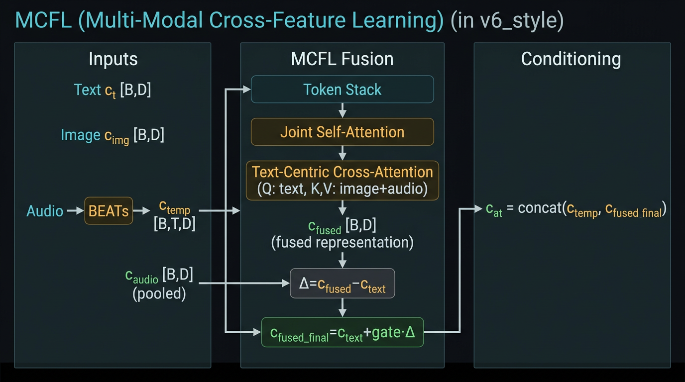
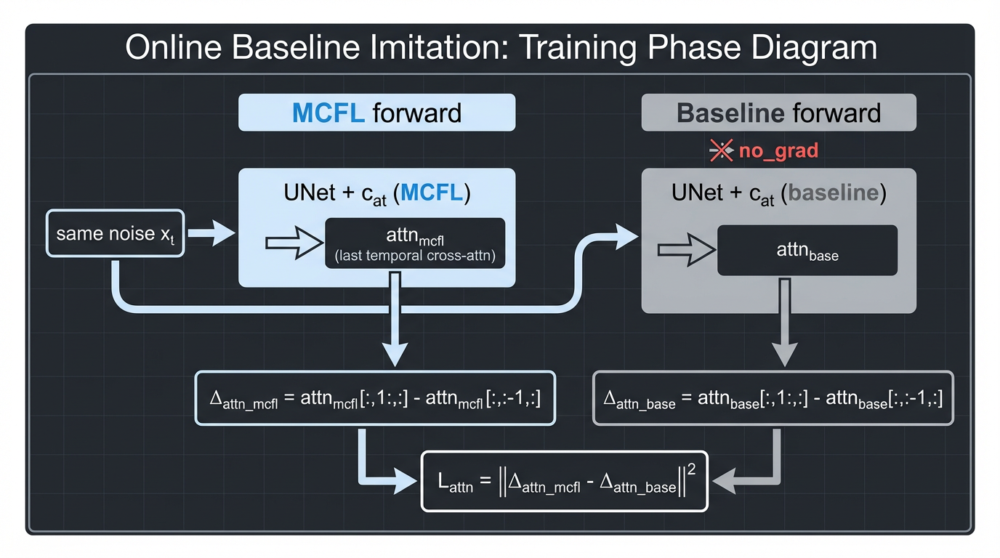

# MCFL 多模态协同特征融合实验报告（优化版）
baseline和mcfl，分别都训练了20000steps和采样了50个视频
---

## 文档说明

本报告系统总结了 **MCFL 方法设计**、**鲁棒音频建模**、**跨分布泛化策略**及**多数据集评估结果**，并对方法的设计动机与实验表现进行统一分析。

**本工作重点关注：** 音频条件视频生成在跨数据集场景中的**稳定性问题**。

具体而言，我们观察到：

- **不同数据集之间存在音频幅值分布差异**
- **音频与视觉的相关性存在显著差异**（强相关 vs 弱相关）
- **直接引入音频条件容易导致时序不稳定（flicker）或条件失效**

为此，我们提出一套**鲁棒的多模态融合与自适应控制框架**，核心包括：

1. **MCFL 多模态协同融合**
2. **鲁棒音频管线**（normalization + 单次压缩）
3. **跨分布训练策略**（randomization + dropout）
4. **自适应条件融合**（adaptive gating + agreement modulation）

---

## 目录

| 章节 | 内容 |
| :--- | :--- |
| 一 | 方法概述 |
| 二 | 鲁棒音频建模 |
| 三 | 实验配置与评估设置 |
| 四 | 实验结果（50 视频） |
| 五 | 结果分析 |
| 六 | Online Baseline Imitation |
| 七 | Gate 标定与改动汇总 |
| 八 | 代码改动与工具 |
| 九 | 小结 |
| 十 | 跨分布鲁棒训练 |
| 十一 | 自适应条件融合（核心） |
| 十二 | 关键设计总结 |
| 十三 | 核心观察 |
| 十四 | 未来工作：Learned Gate 微调 |

---

## 一、方法概述

### 1.1 MCFL 定义

**MCFL（Multi-modal Collaborative Feature Layer）** 是一种多模态协同特征融合模块，用于在视频生成中统一建模文本、图像与音频条件。

与传统条件拼接方法不同，MCFL 通过注意力机制实现显式模态交互：

- **Joint Self-Attention**：对 text / image / audio token 进行对称建模
- **Text-Centric Cross-Attention**：以文本为 query，引导视觉与音频信息融合

> **核心思想**：多模态条件应在统一表示空间中协同决定生成结果，而非独立叠加。

### 1.2 Baseline 局限性

原始 TIA2V Baseline 采用简单拼接：

```text
c_ti = concat(c_text, c_image)
c_at = concat(c_audio, c_text)
```

存在以下问题：

| 问题 | 说明 |
| :--- | :--- |
| 音频利用不足 | audio token 数量远少于 text，导致音频对运动的驱动能力弱 |
| 缺乏模态交互 | 不同模态仅在 UNet 中被动融合 |
| 时序不稳定 | 引入音频后易产生帧间跳变 |

### 1.3 MCFL 集成策略

为保证稳定性，我们采用如下设计：

#### (1) Temporal-only 注入

- **空间条件**保持 baseline（text + image）
- **仅在 temporal 条件中**引入 MCFL

```text
c_fused = c_text + gate · delta
```

其中：

- **delta**：MCFL 输出
- **gate**：自适应控制系数

该设计避免破坏空间结构，同时控制音频对运动的影响。

#### (2) Gated Residual 机制

MCFL 以 **residual** 形式作用：

- baseline 提供稳定基础
- MCFL 提供增量信息

该设计确保：**当音频不可靠时，模型仍可退化为 baseline 行为**。

### 1.4 MCFL 视频生成流程

当前 MCFL 推理流程（以 `sample_motion_optim.py` 为例）如下。

```
┌─────────────────────────────────────────────────────────────────────────────┐
│                           输入                                               │
│  文本 (raw_text)  首帧图像 (video[:,0])  音频 (audio, 16 段 clip)            │
└─────────────────────────────────────────────────────────────────────────────┘
                                        │
                                        ▼
┌─────────────────────────────────────────────────────────────────────────────┐
│                           编码                                                │
│  CLIP Text      → c_t [B, 77, 768]  文本语义                                 │
│  CLIP Image     → image_cat [B, 1, 768]  首帧视觉特征                        │
│  音频: peak 归一 + 单次 compand  → BEATs → c_temp [B*16, 8, 768]             │
│  c_temp 时间 EMA (α=0.9)  减轻帧间 jitter                                    │
└─────────────────────────────────────────────────────────────────────────────┘
                                        │
                                        ▼
┌─────────────────────────────────────────────────────────────────────────────┐
│                           条件构建 (build_conditions, use_mcfl=True)         │
│  c_ti = concat(c_t, image_cat)  [B, 78, 768]  spatial（保持 baseline）       │
│  MCFL(text, image, audio) → c_fused  L2 归一化 + gate 控制                   │
│  gate = conf_norm × av_conf  （[7.2,10.0] + EMA + AV 置信度）                │
│  c_at = concat(c_temp, c_fused_expanded)  [B*16, 8+8, 768]  temporal         │
└─────────────────────────────────────────────────────────────────────────────┘
                                        │
                                        ▼
┌─────────────────────────────────────────────────────────────────────────────┐
│                           扩散采样                                            │
│  init: 首帧保留 + 后续帧置零  → x_0 初始化                                    │
│  p_sample_loop / ddim: x_t → UNet(x_t, t, c_ti, c_at) → x_{t-1}              │
│  UNet: c_ti → spatial cross-attn，c_at → temporal cross-attn                 │
└─────────────────────────────────────────────────────────────────────────────┘
                                        │
                                        ▼
┌─────────────────────────────────────────────────────────────────────────────┐
│                           输出                                                │
│  sample [B, 3, 16, H, W] → clamp(-0.5, 0.5) + 0.5 → 保存为 mp4               │
└─────────────────────────────────────────────────────────────────────────────┘
```

| 阶段 | 说明 |
| :--- | :--- |
| **输入** | 文本、首帧图像、16 段音频 clip |
| **编码** | CLIP 得到 c_t / image_cat；音频 peak 归一 + 单次 compand → BEATs → c_temp，再对 c_temp 做时间 EMA |
| **条件构建** | c_ti 保持 baseline；MCFL 得到 c_fused，经 gate 调制后与 c_temp 拼接为 c_at |
| **扩散采样** | 首帧保留、其余帧置零初始化；UNet 以 c_ti（空间）、c_at（时间）为条件逐步去噪 |
| **输出** | 生成视频 clamp 后保存为 mp4 |

**图 1** 给出 **MCFL（multi-modal fusion module）** 结构示意（左：输入与 BEATs；中：融合模块；右：时序条件构建）。其中：**Text-Centric Cross-Attention** 显式为 **(Q: text, K,V: image+audio)**；**c_fused** 为融合表示（fused representation）；**Δ = c_fused − c_text**，最终注入 **c_fused_final = c_text + gate · Δ**，**gate** 来自 adaptive gating（norm-based + AV-aware，见 §7）；**c_temp** 来自 **Audio → BEATs**，为时序音频特征 [B, T, D]，与 c_fused_final 拼接得到 **c_at = concat(c_temp, c_fused_final)**。



*图 1：MCFL（multi-modal fusion module）结构。左：Text/Image + Audio→BEATs→c_temp（temporal）与 c_audio（pooled）；中：Token Stack→Joint Self-Attn→Text-Centric Cross-Attn (Q: text, K,V: image+audio)→c_fused（fused representation），Δ=c_fused−c_text，c_fused_final=c_text+gate·Δ，gate 为 adaptive（norm + AV）；右：c_at=concat(c_temp, c_fused_final)。*

> **脚注**：**OBI（Online Baseline Imitation）** 在**训练阶段**作用于 **UNet 的 temporal cross-attention**；本图仅展示**条件构建与 MCFL 融合**。训练时双前向与 `L_attn` 示意见 **§6** 与 **图 2**。

---

## 二、鲁棒音频建模

### 2.1 音频归一化与压缩

为避免跨数据集幅值差异，我们采用：

| 组件 | 设置 |
| :--- | :--- |
| 归一化 | `audio_norm_mode=peak` |
| 数据侧压缩 | `audio_soft_clip=none` |
| BEATs 前压缩 | `audio_response=compand` |

**关键原则**：仅进行**单次压缩**（single-stage response）。

### 2.2 关键环节说明

为保证 MCFL 在生成过程中的稳定性与可控性，我们对关键处理环节进行统一设计，如下所示：

| 模块 | 说明 |
|------|------|
| 音频预处理 | 数据侧采用 `audio_norm_mode=peak`、`audio_soft_clip=none`；仅在送入 BEATs 前执行单次非线性压缩（`audio_response=compand`），避免多次压缩带来的分布失真 |
| c_temp EMA | 对 BEATs 输出沿时间维进行指数滑动平均（α=0.9），用于平滑音频条件，减轻帧间 jitter |
| 空间条件（c_ti） | 保持 baseline 结构：`concat(c_text, image_cat)`，不经过 MCFL，以保护空间一致性与视觉结构 |
| 时间条件（c_at） | 由 MCFL 生成融合表示 c_fused，经 gate 控制后与音频特征拼接：`c_at = concat(c_temp, c_fused_expanded)` |
| UNet 条件注入 | `context=c_ti`（spatial），`context_temp=c_at`（temporal），实现空间与时间条件解耦 |
| 初始化方式 | 首帧使用真实视频帧，其余帧初始化为零，引导扩散模型逐步生成后续时序内容 |

该设计确保：**空间结构稳定 + 时间条件可控增强**。

### 2.3 训练与推理一致性

为避免分布偏移导致性能退化，训练与推理阶段需严格保持一致，具体包括：

#### (1) Gate 参数一致

- `norm_low=7.2`，`norm_high=10.0`；`gate_ema=0.9`
- **AV 置信度（可选）**：`use_av_conf=True`，`av_beta=0.5`，`av_sim_low` / `av_sim_high`  
  默认配置中 AV gate 关闭，仅在需要增强鲁棒性时启用。

#### (2) 音频管线一致

- **数据侧**：`audio_norm_mode=peak`，`audio_soft_clip=none`
- **BEATs 前**：单次压缩（推荐 `audio_response=compand`）  
  **注意**：训练脚本默认 `tanh`，需显式设置为 `compand` 以保持一致。

#### (3) 时序平滑一致

- c_temp EMA α=0.9

**核心原则**：避免 train / sample mismatch，保证 gate 与音频特征分布一致。

---

## 三、实验配置与评估设置

### 3.1 数据集

我们在三个具有不同音画相关性的典型数据集上进行评估：

| 数据集 | Real | Baseline | MCFL |
|--------|------|----------|------|
| post_URMP | results/3_tacm_/real | results/3_tacm_/fake1_30fps | results/6_tacm_/fake1_30fps |
| post_landscape | results/7_tacm_/real | results/7_tacm_/fake1_30fps | results/8_tacm_/fake1_30fps |
| post_audioset_drums | results/9_tacm_/real | results/9_tacm_/fake1_30fps | results/10_tacm_/fake1_30fps |

这三个数据集分别对应：**中等相关 / 弱相关 / 强相关** 的音画关系。

### 3.2 评估指标

| 指标 | 方向 | 说明 |
| :--- | :---: | :--- |
| FVD | ↓ | 视频分布一致性 |
| FID | ↓ | 视觉质量 |
| FFC | ↓ | 首帧一致性 |
| CLIP | ↑ | 文本语义对齐 |
| AV_ALIGN | ↑ | 音画对齐 |
| TC_FLICKER | ↓ | 时间一致性（优先参考 median） |

### 3.3 关键配置

| 项目 | 设置 |
| :--- | :--- |
| Gate 标定 | `norm_low=7.2`，`norm_high=10.0` |
| 时间平滑 | `gate_ema=0.9` |
| 音频处理 | peak normalization + single compand |
| AV Gate（可选） | β=0.5，sim ∈ [0.0, 0.3] |

---

## 四、实验结果（50 视频）

> **关键总结**：在三个数据集上的实验结果表明，MCFL 的性能与**音画相关性**强相关——强相关（drums）显著提升；弱相关（landscape）存在质量与稳定性 trade-off；中等相关（URMP）接近 baseline。

### 4.1 FVD（↓）

| 数据集 | Baseline | MCFL | Δ |
|--------|----------|------|-----|
| URMP | 28.60 | 30.61 | +2.01 |
| Landscape | 58.01 | 60.65 | +2.64 |
| Drums | 97.60 | 74.48 | **−23.12** |

### 4.2 FID（↓）

| 数据集 | Baseline | MCFL | Δ |
|--------|----------|------|-----|
| URMP | 465.61 | 562.13 | +96.51 |
| Landscape | 604.90 | 568.16 | **−36.74** |
| Drums | 1784.72 | 744.92 | **−1039.80** |

### 4.3 CLIP（↑）

| 数据集 | Baseline | MCFL | Δ |
|--------|----------|------|-----|
| URMP | 0.2910 | 0.2862 | − |
| Landscape | 0.1922 | 0.1943 | + |
| Drums | 0.2197 | 0.2219 | + |

### 4.4 AV_ALIGN（↑）

| 数据集 | Baseline | MCFL | Δ |
|--------|----------|------|-----|
| URMP | 0.5063 | 0.4937 | − |
| Landscape | 0.4824 | 0.4242 | − |
| Drums | 0.3639 | 0.4021 | + |

### 4.5 TC_FLICKER（↓）

**优先参考 median**（更鲁棒）

| 数据集 | Baseline | MCFL | Δ |
|--------|----------|------|-----|
| URMP | 23.15 | 27.12 | + |
| Landscape | 152.63 | 163.90 | + |
| Drums | 131.17 | 52.78 | **−** |

> **结果规律**：MCFL 的有效性取决于音画相关性（audio-visual correlation）。

| 场景 | 表现 | 说明 |
|------|------|------|
| **(1) 强相关（Drums）** | 全面提升（FID / FVD / Flicker） | 说明音频对运动具有强驱动作用 |
| **(2) 中等相关（URMP）** | 接近 baseline | 说明视觉信息已能较好建模运动 |
| **(3) 弱相关（Landscape）** | FID / CLIP 提升（质量提升），Flicker 增大（运动增强） | 说明 MCFL 在弱相关场景中引入额外动态 |

---

## 五、结果分析

### 5.1 跨数据集表现分析

在三个数据集上的结果表明，MCFL 的性能与**音画相关性（audio-visual correlation）**密切相关：

| 数据集 | 主要结论 |
|--------|----------|
| **post_URMP（中等相关）** | MCFL 与 baseline 整体表现接近。FFC 略优（−0.0003），但 FVD、FID、CLIP、AV_ALIGN 略有下降（Δ +2.01、+96.51、−0.0049、−0.0126），TC_FLICKER median 小幅上升（+3.98）。说明在已有较强视觉引导的场景中，额外的音频条件对生成贡献有限，甚至可能引入轻微扰动 |
| **post_landscape（弱相关）** | MCFL 在视觉质量（FID −36.74）与语义一致性（CLIP +0.0021）上优于 baseline，但 FVD、FFC、AV_ALIGN 略逊。TC_FLICKER mean 下降（−15.49），但 median 上升（+11.27），表明存在少量异常样本。整体表现体现出质量提升与时序稳定性之间的 trade-off |
| **post_audioset_drums（强相关）** | MCFL 在几乎所有指标上均显著优于 baseline：FVD（−23.12）、FID（−1039.80）、CLIP（+0.0022）、AV_ALIGN（+0.0382）、TC_FLICKER（mean −99.36、median −78.39）。说明在强音画相关场景中，MCFL 能有效利用音频驱动生成，显著提升生成质量与一致性 |

> **核心结论**：MCFL 的有效性与音画相关性呈正相关——强相关（drums）显著提升；中等相关（URMP）接近 baseline；弱相关（landscape）质量提升但稳定性存在 trade-off。  
> 音频条件在视频生成中具有**条件依赖性**：其作用强度应随音画一致性动态调整。

### 5.2 drums：从跨分布崩坏到稳定提升

#### (1) 早期问题

在未进行标定与音频管线优化前，MCFL 在 drums 上出现典型跨分布崩坏：

- FID ↑ +912
- FVD ↑ +23
- AV_ALIGN ↓ −0.15

主要原因包括：

- Gate 标定错误：区间 [5, 30] 与实际 norm（8.3–8.9）严重不匹配
- 双重压缩（tanh + tanh）：导致强瞬态音频失真
- 缺乏时间平滑：条件在帧间剧烈波动

#### (2) 当前改进效果（50 视频）

通过以下改进：Gate 标定 [7.2, 10.0]、单次压缩（compand）、c_temp EMA（α=0.9）、gate 时间平滑，得到：

- **FID**：1785 → 745（−1039）
- **FVD**：97.6 → 74.5（−23.1）
- **TC_FLICKER median**：131 → 52（−78）

> **关键 insight**：MCFL 本身不是问题，问题在于「条件标定 + 分布对齐」。一旦音频条件被正确标定并稳定化，MCFL 在强相关数据上可显著提升生成质量与时序一致性。

### 5.3 TC_FLICKER 分析（鲁棒解读）

由于 TC_FLICKER 对异常值敏感，本实验采用：**median 为主，mean 为辅**。

| 数据集 | 现象 | 说明 |
|--------|------|------|
| **(1) URMP** | median +3.98（轻微上升）；mean 受高方差影响（52 → 59） | 音频引入轻微额外时序变化，整体稳定性仍接近 baseline |
| **(2) landscape** | mean 下降（−15.49），median 上升（+11.27） | 存在少量异常 flicker 样本，整体趋势不一致，属于高方差数据集典型现象 |
| **(3) drums** | mean −99.36，median −78.39 | 大多数视频 flicker 显著降低，MCFL 在强相关数据上显著提升时间一致性 |

> **总结**：MCFL 并不会普遍增加 flicker，其影响取决于音频条件的可靠性。

---

## 六、Online Baseline Imitation（优化版）

### 6.1 设计动机

在 MCFL 引入后，音频条件增强了 temporal attention 的响应能力，但同时也带来了：**帧间 attention 波动放大 → flicker 增加**。

为此，我们提出 **Online Baseline Imitation（OBI）**。

**核心思想**：用 baseline 的 temporal attention 作为“稳定先验”，约束 MCFL 的 attention 变化模式，使其在**保持多模态能力**的同时**不偏离 baseline 的稳定性**。

### 6.2 方法定义

在 Temporal Cross-Attention 中，`attn: [B*H, F, M]`。计算帧间差分：

```text
Δattn = attn[:, 1:, :] - attn[:, :-1, :]
```

定义 imitation loss：

```text
L_attn = ||Δattn_mcfl − Δattn_base||²
```

**图 2** 给出训练阶段 **Online Baseline Imitation** 的流程示意：在**同一 noise** 下分别进行 **MCFL 前向**（`c_at` 含 MCFL）与 **baseline 前向**（`c_at` 无 MCFL，`no_grad`），从**最后一层 temporal cross-attention** 取出 `attn_mcfl` / `attn_base`，沿时间维计算 **Δattn**，再最小化两者差分的 L2。



*图 2：训练阶段 OBI。共享 `x_t`（同一 noise）→ 双前向（UNet + `c_at^MCFL` vs UNet + `c_at^baseline`）→ 取最后一层 temporal attn → `Δattn = attn[:,1:,:] − attn[:,:-1,:]`（沿 query/time 维）→ `L_attn = ||Δattn_mcfl − Δattn_base||²`（`attn_base` 不反传）。*

### 6.3 实现机制

| 组件 | 说明 |
|------|------|
| 双前向 | 同一 noise 下分别计算 MCFL 与 baseline attention |
| baseline no_grad | baseline 作为 teacher，不参与梯度更新 |
| attn_cache | 从 temporal attention block 收集 attention |
| 共享输入 | 确保 x_t 一致，保证可比性 |

### 6.4 训练目标

```text
loss = loss_diffusion + λ_attn × L_attn
```

其中：MCFL 学习生成能力，imitation loss 约束时序稳定性。

### 6.5 λ 调度（关键）

| 训练阶段 | λ_attn |
|----------|--------|
| 初期 | 0.1 |
| 中期 | 0.03 |
| 后期 | 0.005 |

**设计意义**：避免 MCFL 被过度限制，同时逐步释放其表达能力。

### 6.6 方法定位

Online Baseline Imitation ≈ **temporal distillation / regularization**。

其作用是：

- **不改变模型结构**
- **仅约束 temporal dynamics**
- **提供稳定性保障**

---

## 七、Gate 标定与改动汇总

### 7.1 问题与改进对应关系

为解决 MCFL 在跨数据集场景中的不稳定性，我们对 gate 标定、音频响应与时序平滑策略进行了系统性改进。主要问题与对应方案如下：

| 问题 | 改进 |
|------|------|
| Gate 区间 [5, 30] 与 drums 的 BEATs norm 分布严重脱节 | 采用统一标定区间 [7.2, 10.0]，覆盖三数据集 pooled norm 的 p5–p95 范围 |
| 双重非线性压缩（tanh + tanh）导致强瞬态失真 | 改为**单次压缩**：`audio_soft_clip=none` + `audio_response=compand` |
| 条件在时间维波动过大，易放大帧间跳变 | 引入 **c_temp EMA（α=0.9）** 与 **gate EMA（0.9）** |
| 不同数据集之间音频幅值分布差异明显 | 引入 Random Gain、Modality Dropout、L2 归一化（`mcfl_norm_modality=True`） |

这些改动的核心目标是：**让 gate 在正确的条件下开启，并在异常条件下自动收缩**。

### 7.2 三数据集 BEATs pooled norm 统计

为进行统一标定，我们统计了三数据集在当前音频管线下的 BEATs pooled norm 分布：

| 数据集 | mean | std | p5 | p95 |
|--------|------|-----|-----|-----|
| post_audioset_drums | 8.57 | 0.16 | 8.30 | 8.82 |
| post_URMP | 8.08 | 0.69 | 7.44 | 9.79 |
| post_landscape | 8.58 | 0.23 | 8.19 | 8.90 |

由此可见，统一 gate 区间 [7.2, 10.0] 能够有效覆盖三数据集的大部分正常样本，同时为异常输入保留自动抑制空间。

该标定策略的关键作用在于：**避免 gate 长期过弱（条件失效）或长期过强（条件噪声放大）**。

### 7.3 AV 置信度 Gate

为进一步提升跨域稳定性，在 norm-based gate 的基础上，我们引入了 audio-visual agreement modulation。当 `mcfl_gate_use_av_conf=True` 时，最终 gate 定义为：

```text
av_conf = clamp((sim - av_sim_low) / (av_sim_high - av_sim_low), 0, 1)
gate_final = gate_norm × ((1 − beta) + beta × av_conf)
```

其中：

- **sim** 为 audio–image cosine similarity
- **av_conf** 表示音画一致性置信度
- **beta** 控制 AV 置信度对 gate 的调制强度

推荐参数如下：

| 参数 | 推荐值 | 说明 |
|------|--------|------|
| mcfl_gate_use_av_conf | True | 启用 AV 置信度调制 |
| mcfl_gate_av_beta | 0.5 | 混合强度，0 表示无影响，1 表示完全由 av_conf 调制 |
| mcfl_gate_av_sim_low | 0.0 | 相似度映射下界 |
| mcfl_gate_av_sim_high | 0.3 | 相似度映射上界 |

该设计的作用是：**当音画对齐弱时，适当压低 gate，减少无效音频条件对生成过程的干扰。** 这一机制在弱相关数据集（如 landscape）中尤为重要。

### 7.4 推荐训练与推理配置

下表总结了当前推荐的训练/推理配置：

| 类别 | 参数 | 推荐值 | 说明 |
|------|------|--------|------|
| 音频 | audio_norm_mode | peak | 数据侧归一化 |
| 音频 | audio_soft_clip | none | 避免与 response 叠加形成双重压缩 |
| 音频 | audio_response | compand | 训练脚本默认 tanh，建议显式传入 `--audio_response compand`；采样脚本默认已为 compand |
| Gate | mcfl_gate_norm_low | 7.2 | 与当前 calibration 一致 |
| Gate | mcfl_gate_norm_high | 10.0 | 同上 |
| Gate | mcfl_gate_ema | 0.9 | 时间平滑 |
| Gate | mcfl_gate_lambda | 0.1 | 当前推荐注入强度 |
| Gate（可选） | mcfl_gate_use_av_conf | True（推荐） | 训练/采样脚本默认 False，需显式开启 |
| Gate（可选） | mcfl_gate_av_beta | 0.5 | AV 调制强度 |

---

## 八、代码改动与工具

### 8.1 关键代码模块

本工作涉及的主要代码改动如下：

| 模块 | 改动 |
|------|------|
| tacm/data.py | 在 TAVDataset 中加入 audio_norm_mode、audio_soft_clip、audio_rms_target，实现数据加载阶段的音频归一化与预处理 |
| diffusion/tacm_train_temp_util.py | 增加 Random Gain、单次 response（tanh/compand）、Modality Dropout（当前仅 audio）、c_temp EMA，以及所有 gate / AV 参数传递 |
| diffusion/condition_builder.py | 实现 norm / z-score gate 标定、gate 时间 EMA、AV 置信度 Gate、模态 L2 归一化（mcfl_norm_modality）、delta scale 与归一化 |
| scripts/sample_motion_optim.py | 与训练侧保持一致的 gate / 音频配置；默认单次 response 为 compand；支持 AV Gate 参数 |
| scripts/train_temp.py | 新增 gate、AV、音频相关命令行参数；注意默认 `audio_response='tanh'`，建议显式改为 compand |

### 8.2 统计与标定工具

| 工具 | 用途 |
| :--- | :--- |
| scripts/audio_beats_stats.py | 统计原始音频与 BEATs pooled / per-frame norm，给出 gate 区间建议 |
| scripts/unify_gate_calibration.py | 融合多数据集统计，输出统一 low/high 或 z-score 参数 |
| scripts/MCFL_GATE_CALIBRATION.md | 记录 gate 标定流程、验证矩阵与防炸护栏说明 |

---

## 九、小结

### 9.1 实验结论

基于 2026-03-16 的三数据集、50 视频评估结果，可以得到以下结论：

1. **在强音画相关场景（post_audioset_drums）中，MCFL 显著优于 baseline。** 改进后的 MCFL 在 FVD、FID、AV_ALIGN、TC_FLICKER 等多个关键指标上均显著提升，说明多模态协同融合在强 audio-driven 场景中具有明显优势。

2. **在弱音画相关场景（post_landscape）中，MCFL 提升了部分质量指标，但带来了稳定性 trade-off。** 具体表现为 FID、CLIP、TC mean 改善，而 median flicker 与 AV_ALIGN 略逊。这表明在音频与视觉关联较弱时，音频条件的使用需要更加保守。

3. **在中等相关场景（post_URMP）中，MCFL 与 baseline 整体接近。** FFC 略优，其余指标接近或略逊于 baseline，说明该数据集上已有视觉先验已能较好支持生成，音频带来的增益有限。

### 9.2 方法层面的关键发现

drums 数据集从早期的“跨分布崩坏”到当前的显著改善，说明以下设计是有效的：

- 统一 gate 标定
- 单次 compand
- c_temp / gate 的时间平滑
- 音频随机化与 dropout 策略

这些改动共同说明：**MCFL 的问题不在于融合本身，而在于条件标定与时序控制是否合理。**

---

## 十、跨分布鲁棒训练

为提升泛化能力，引入：

### 10.1 Randomization

- **Random Gain**
- **Random Response Strength**

增强模型对音频幅度变化的适应性。

### 10.2 Modality Dropout

随机将 **audio 条件置零**：`c_temp = 0`。

使模型学习：在无音频或弱音频条件下保持稳定生成。

---

## 十一、自适应条件融合（核心）

本工作核心贡献之一是：**Adaptive Gating for Audio Conditioning**。

### 11.1 Norm-based Gate

基于 BEATs 特征范数：

- `norm_low = 7.2`
- `norm_high = 10.0`

映射为置信度，控制音频条件强度。

### 11.2 Temporal Smoothing

对 gate 做时间 EMA：`gate_ema = 0.9`。

降低：帧间抖动、flicker。

### 11.3 Guardrails

- `gate_lambda_max = 0.2`
- `norm_clip_clamp = True`

防止：单帧异常导致条件爆炸。

### 11.4 Agreement-aware Gating

引入 audio–visual 相似度：

```text
gate = gate × ((1 − β) + β × av_conf)
```

其中：

- **av_conf**：audio–image cosine similarity
- **β**：控制强度

作用：**音画一致时增强条件，不一致时抑制条件**。

---

## 十二、关键设计总结

本方法的核心不是单一模块，而是一个**统一框架**：

| 模块 | 作用 |
| :--- | :--- |
| MCFL | 多模态协同融合 |
| 音频管线 | 统一输入分布 |
| 随机化训练 | 提升泛化 |
| Adaptive Gate | 控制条件强度 |
| Agreement Gate | 控制条件可靠性 |

---

## 十三、核心观察（重要结论）

实验表明：**MCFL 的有效性与音画相关性强相关**。

| 数据集类型 | 表现 |
| :--------- | :--- |
| 强相关（drums） | 显著提升 |
| 中等相关（URMP） | 接近 baseline |
| 弱相关（landscape） | 存在 trade-off |

详细分析见 **§5.1 跨数据集表现分析** 与 **§9.1 实验结论**。

---

## 十四、未来工作：Learned Gate 微调

在当前 norm gate + agreement gate 的基础上，一个自然的后续方向是引入 **learned refinement gate**，实现“手工先验保底 + 学习型修正”的混合门控。

### 14.1 基本形式

我们考虑如下形式：

```text
g = g_hand · σ(MLP(x))
```

其中：

- **g_hand** 为当前 hand-crafted gate：`g_hand = λ_max · c_norm · ((1−β) + β·c_av)`
- **σ(MLP(x)) ∈ (0, 1)** 为 learned refinement factor

该设计的优势在于：

- 不破坏已有鲁棒性设计
- 学习模块只负责微调
- 失败风险低于直接用纯 learned gate 替代手工 gate

### 14.2 推荐最小实现

推荐先从 **clip-level learned gate** 开始，即每个 clip 仅预测一个 gate factor。输入特征可选为以下 4 维：

- pooled audio feature norm
- pooled image feature norm
- audio–image cosine similarity
- per-frame audio norm 的时间标准差

这些特征可作为一个轻量统计向量输入 MLP，经 sigmoid 输出 learned factor。

为提高稳定性：

- 对输入特征使用 detach
- 对 learned factor 引入轻量正则（如均值约束）
- 保持 hand-crafted gate 不变，仅做 refinement


### 14.4 方法定位

该方向的整体叙事可以概括为：

**robust hand-crafted prior + learned adaptive correction**

即：hand-crafted gate 提供稳定先验，learned gate 学习更细粒度的条件修正。这使得未来工作能够从“规则式鲁棒控制”进一步过渡到“学习型自适应控制”。

---


